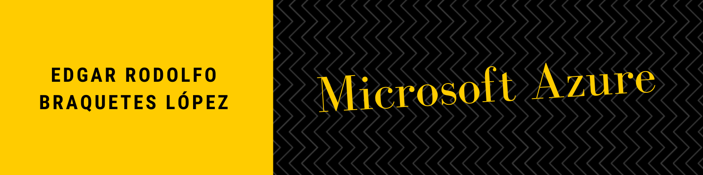

# Certificación de Microsoft-Azure

## Retos semanales de la certificación en Microsoft Azure

### Retos
- [Semana 1](#semana-1)

# Semana 1

### ¿Qué es la Computación en la Nube? 
El cloud computing consiste en usar servicios y recursos informáticos de un proveedor como `Microsoft Azure`, `Amazon Web Services (AWS)` o `Google Cloud Platform (GCP)`. Suelen tener un modelo de pago por uso y permiten alquilar servicios de almacenamiento, redes y máquinas virtuales.

### Servicios
- Maquinas virtuales:
Las máquinas virtuales emulan un servidor. Es un equipo informático aislado con un sistema operativo Linux o Windows y un hardware limitado. Sobre una máquina virtual podremos instalar el software que necesitemos y configurarlo a nuestro gusto. Ofrecen un control total sobre el sistema operativo.
Las máquinas virtuales son una parte de un servidor compartido remoto. Esta virtualización se asegura de aislar y securizar cada máquina virtual para que sea un sistema independiente. Además, aportan numerosas ventajas, ya que se pueden desplegar muy rápido, hacer copias de seguridad y redimensionar fácilmente.

- Contenedores:
En los proveedores cloud también podemos desplegar contenedores. La plataforma más popular es Docker. Estos contenedores nos permiten ejecutar entornos sin sistema operativo integrado para ejecutar nuestras aplicaciones de forma portable o crear arquitecturas de microservicios. En Azure, el servicio PaaS llamado Azure Container Instances nos permite ejecutar de forma sencilla estos contenedores. También ofrecen servicios de orquestación de contenedores como Kubernetes. Este servicio se denomina EKS o Elastic Kubernetes Service en AWS y AKS o Azure Kubernetes Service en Azure.

- Serverless:
En este caso, el proveedor se encarga de proporcionar de forma transparente los recursos necesarios. Generalmente, estas funciones se ejecutan como respuesta a eventos como peticiones REST o temporizadores. Las funciones no contienen estado, cada vez que se ejecutan lo hacen desde cero. En el caso de que queramos mantener algún estado o persistencia deberemos conectar servicios externos como bases de datos o cuentas de almacenamiento. En AWS esta funcionalidad se denomina Lambda y en la plataforma de Azure se denominan Azure Functions. Por otro lado, Azure Logic Apps nos permite implementar flujos de trabajo de orquestación mediante una GUI de manera declarativa. En Azure también existe una extensión de las funciones llamada Durable Functions que sí nos permite mantener cierto estado.

### Modelos de Implementación en la Nube

- Nube Privada: 
Una nube privada se despliega en el centro de datos del cliente. La empresa cliente sigue siendo responsable de la infraestructura y del software instalado para dar servicio a departamentos. La ventaja más importante de una nube privada es la seguridad. La organización que la despliega puede establecer todas las medidas de seguridad que estén a su alcance y es la responsable.

- Nube Pública:
La nube pública consiste en contratar los servicios de un proveedor, que es el que administra estos recursos de forma remota. En este caso, no se puede administrar físicamente el hardware.

- Nube Híbrida:
La nube híbrida combina los dos modelos anteriores. Parte del software de una organización puede ejecutar en una nube privada y otra parte en la nube pública. De esta forma, se pueden conseguir las ventajas de ambos modelos. Por un lado la escalabilidad y eficiencia de la nube pública para las aplicaciones en las que sea posible. Por otro lado, pueden existir datos o aplicaciones que no deben ejecutar en nube pública por motivos de seguridad o cumplimiento que ejecutarán en la nube privada.

### Tipos de Servicios en la Nube

- Infraestructura como Servicio (IaaS):
En esta categoría el usuario alquila la infraestructura informática que necesite y la administra a través de internet. Pueden ser servidores, almacenamiento y máquinas virtuales. La responsabilidad de que el servicio funcione es compartida entre el usuario y el proveedor cloud.

- Plataforma como Servicio (PaaS):
La plataforma como servicio proporciona un entorno en el que no es necesario administrar la infraestructura a tan bajo nivel como en IaaS. Generalmente en un PaaS se ofrecen recursos de desarrollo e implementación de soluciones.

- Software como Servicio (SaaS):
El software como servicio proporciona acceso a software ya instalado y administrado. Funciona con una licencia o suscripción periódica. En esta categoría el usuario tiene la mínima responsabilidad, y solamente se limita a acceder y usar el servicio.

### Azure
- Soluciones en la Nube:
Las soluciones en la nube se entregan en forma de infraestructura como servicio (IaaS), plataforma como servicio (PaaS) y software como servicio (SaaS).
Es decir, los servicios de Azure van desde servicios sencillos para sitios web en la nube hasta la implementación de equipos totalmente virtualizados para ejecutar soluciones de software personalizadas. Azure permite a un negocio tener una alta disponibilidad de sus servicios, hacer una entrega más rápida de nuevas características a sus clientes, reducir los requisitos para administrar tecnologías de la información y facilitar la escalabilidad de un servicio.
- Servicios de infraestructura:
La información y los datos de una organización son los activos más valiosos. Azure ofrece durabilidad y alta disponibilidad, seguridad mediante el cifrado automático y control de acceso basado en rol donde Azure ofrece servicios de almacenamiento seguros que pueden adaptarse a las necesidades de varias organizaciones, escalabilidad con un almacenamiento prácticamente ilimitado, administración y control del mantenimiento y de cualquier problema crítico que pueda surgir y accesibilidad desde cualquier parte del mundo a través de HTTP o HTTPS. Los especialistas en seguridad de la información recomiendan que existan varios respaldos de la información digital de una empresa.
- Soluciones tecnológicas en menos tiempo, `Web Apps` y `Logic Apps`:
Azure provee un servicio de Web Apps que te ayuda a elaborar, desplegar y escalar una aplicación web, móvil o una API en menos tiempo y con las tecnologías que ya conoces. Logic Apps ofrece una variedad de tareas que puedes automatizar sin tener que escribir código, por ejemplo detonar una acción al recibir un correo o a cierta hora del día.

##### Autor: Edgar Rodolfo Braquetes López
